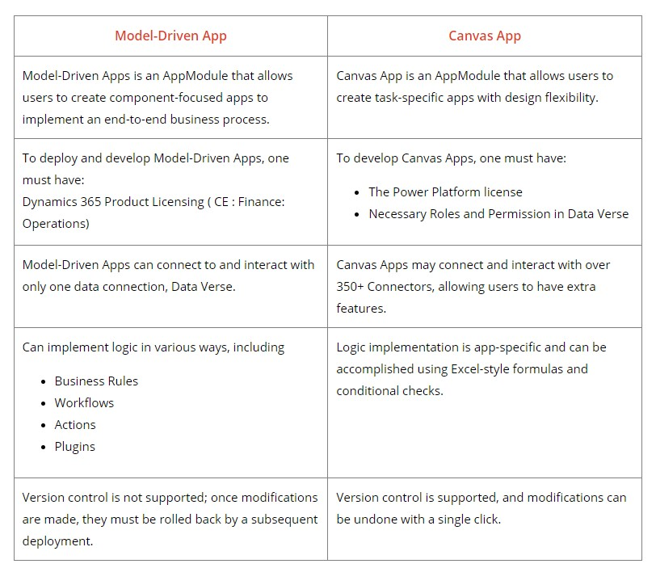
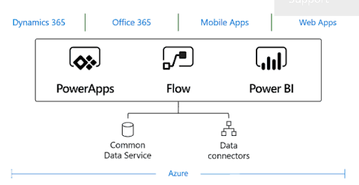

## 1. What is Office 365 tenent

Microsoft Office 365 tenent is the set of services assigned to the organization. Generally, this tenent is associated with one or more of public DNS domain name and acts as a central and isolated container for different subscriptions and the licenses within them that you assign to user accounts.

## 2. What is Power Apps

Power Apps is a suite of apps, services, and connectors, as well as a data platform, that provides a rapid development environment to build custom apps for business needs.

Power Apps is a Platform as Service. It enables you to create mobile apps that run on different operating systems, such as Windows, iOS, and Android.

## 3. What programming language is Power Apps?

Microsoft Power Fx is currently powering the MS Power Apps. MS Power Fx, is a low-level programming lanugage used to represent logic across the MS Power Platform.

## 4. What are the main components of Power Apps?

Gallery: A gallery in the app is a way to visualize data. It is a set of displays used to view and nevigate data.

Screen: A screen is a method of visualizing a specific data collection or records.

Card: A card is a screen area that displays a specific record from the SharePoint list or any other database from which you built an app.

Control: Controls allow you to see and interect with records.

Property: Each control has its own set of properties.

Function: Functions are used to interact with andchange the characteristics.

## 5. PowerApps features?

- Common data service for data storage
- To integrate data and systems, more than 200+ connectors are available
- Drag-anddrop designer
- Pre-built templates
- AI builder
- Role-based user-experience customization

## 6. Benefits of using PowerApps

- Power Apps allowes you to create apps more quickly
- User can create Apps without coding
- Support many data sources and online services
- Business automization
- AI Capabilities
- Simple deployment and cross-platform
- Cost-effective

## 7. Difference between Model-driven app and Canvas app

## 8. Define common data services, and why should we use them?

Common data service allowes the data get integrated from different sources into one store that can be easily used in Power Automate, Power Virtual Agent, Power Bi, and Power Apps. This makes the app developing experience seamless.

In the common data service, data is kept as a collection of entities. An entity is a collection of records used to store data like a table in a database.

## 9. Different ways to submit data from Power Apps?

Data submission done can be two ways - Patch() and Submit form(). Patch() can also used to upload partial data.

## 10. What is Power Automate?

Power Automate is a cloud-based service that makes it practical and simple for line-of-business users to build workflows that automate time-consuming business tasks and processes across applications and services.

## 11. Who is the intended audience for Power Automate?

- Line-of-business in the enterprise prganizations who partner with IT to move responsibiltiy for business solutions closer to the business itself.
- IT decision makers who want to empower line-of-business partners to create their own solutions so IT professionals and integration specialists can focus their expertise on more advanced integration tools, such as Azure Logic Apps.
